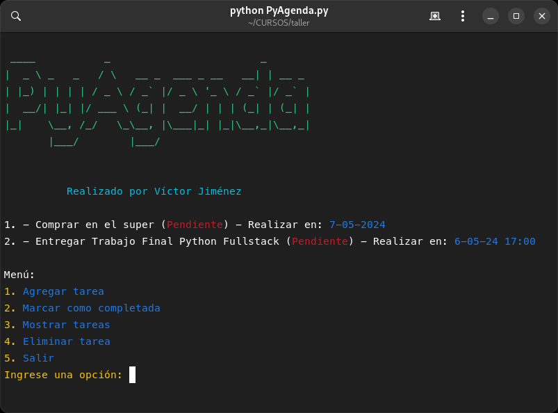
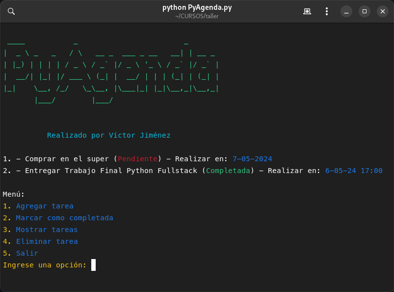
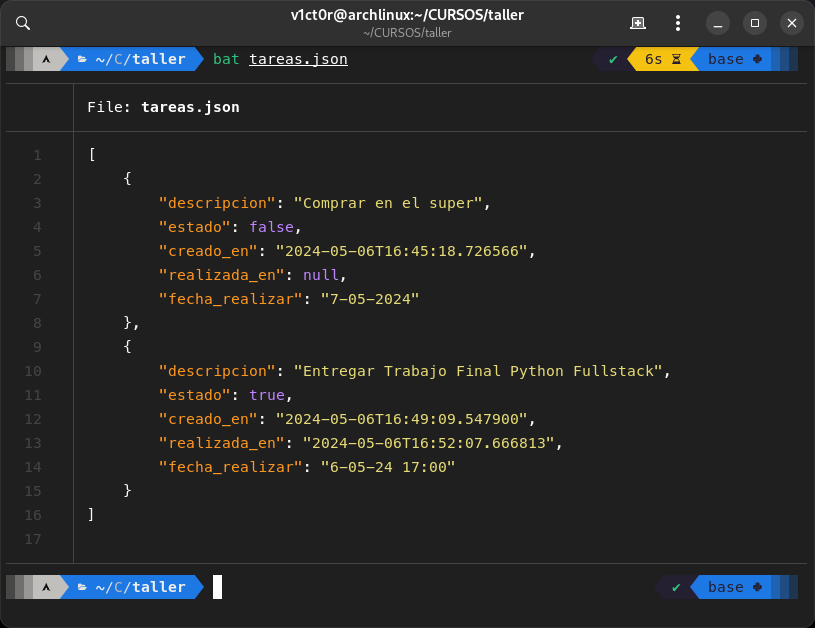

# PyAgenda
Task manager written in Python

PyAgenda is a simple task management program written in Python. It allows you to add, complete, display, and delete tasks. The tasks are stored in a JSON file for persistence.





## Classes

### Tarea

This class represents a task. It has the following attributes:

- `descripcion`: Description of the task.
- `estado`: Indicates whether the task is completed (`True`) or pending (`False`).
- `creado_en`: Task creation time (ISO 8601 format).
- `realizada_en`: Task completion time (ISO 8601 format).
- `fecha_realizar`: Date and time when the task should be performed (ISO 8601 format).

### GestorTareas

This class manages the task list. It has the following attributes:

- `tareas`: List of `Tarea` objects.
- `archivo`: Path to the JSON file where the tasks are stored.

It also has methods to load tasks from the JSON file (`cargar_tareas`), save tasks to the JSON file (`guardar_tareas`), add a new task to the list (`agregar_tarea`), mark a task as completed (`marcar_completada`), display all tasks (`mostrar_tareas`), and delete a task (`eliminar_tarea`).

## Functions

- `mostrar_portada`: Displays the ASCII art title.
- `main`: The main function of the program. It displays a menu with options to add a task, mark a task as completed, display tasks, delete a task, or exit the program.

## Usage

When you run the program, it displays a menu with the following options:

1. Add task
2. Mark as completed
3. Show tasks
4. Delete task
5. Exit

You can select an option by entering its number. If you select an option that requires a task position (mark as completed or delete), the program first displays all tasks with their positions.

## Example

Here is an example of how to use the program:

```
$ python PyAgenda.py
```

Then, follow the prompts to manage your tasks.
